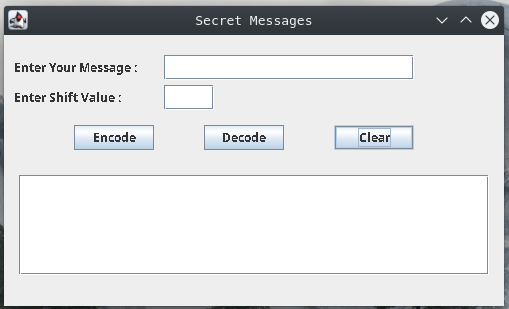
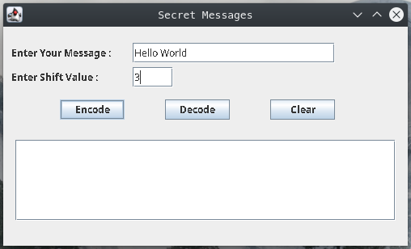
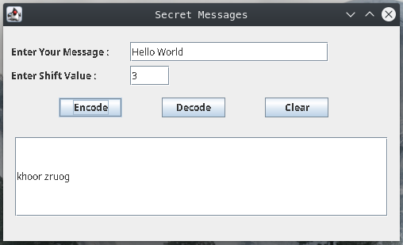
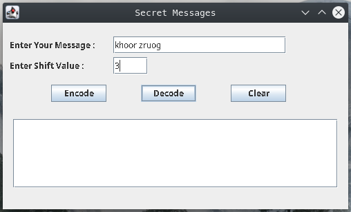
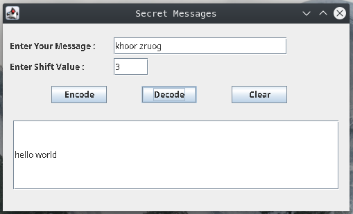
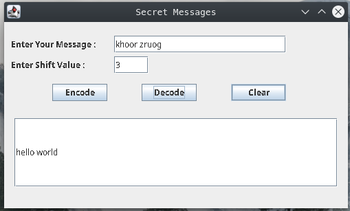

# Secret Message
Secret Message is a simple tool that Encrypt and Decrypt messages using Caesar cipher.

## Caesar cipher
In cryptography, a Caesar cipher, also known as Caesar's cipher, the shift cipher, Caesar's code or Caesar shift, is one of the simplest and most widely known encryption techniques. It is a type of substitution cipher in which each letter in the plaintext is replaced by a letter some fixed number of positions down the alphabet. For example, with a left shift of 3, D would be replaced by A, E would become B, and so on. The method is named after Julius Caesar, who used it in his private correspondence.

[Ceasar Cipher](https://en.wikipedia.org/wiki/Caesar_cipher)

# Folder Structure
|Path |Contain |
|--------|------------|
build/classes/java/main/  | Contains all the Classes
lib/ | Contains all the Libraries
src/main/java/ | Contains all the Source Codes
src/test/java/ | Contains all the Test Cases
images/ | Contains all the Images

# How to use
Download the SecretMessage.jre file and double click on it. [SecretMessage](https://github.com/ravdsn/secret-message/tree/master/SecretMessageJRE)

# Interface

### Front

### Encode

### Decode

### Clear

